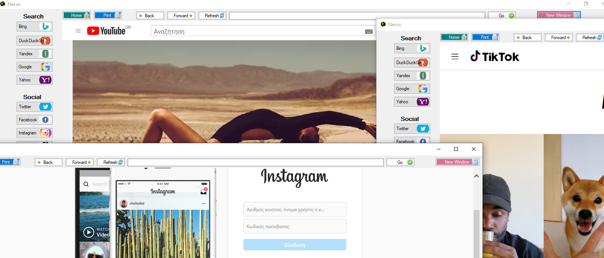

# nexus-browser
Nexus-Browser is a anonymous and vpn browser   

Properties and Details   
1) Supports all windows operating systems after windows xp   windows xp, vista, 7, 8, 8.1, 10   
2) Anonymous browsing with socks vpn.   
3) Anonymous activity (no save cookies, ip, location etc)   
4) Support many windows for fast and safe browsing  
5) Many default famous web apps with one button  
6) No installation to your pc. Run browser directly  
7) Print your data and connect to your printer  
8) Connect with your email and cloud  
9) Make online meetings fast and easy  
10) Fast easy and simple graphical interface for use  
 
<a href="download/nexus.exe"> Download </a>  

    
