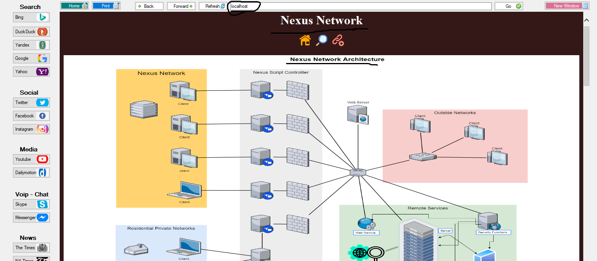
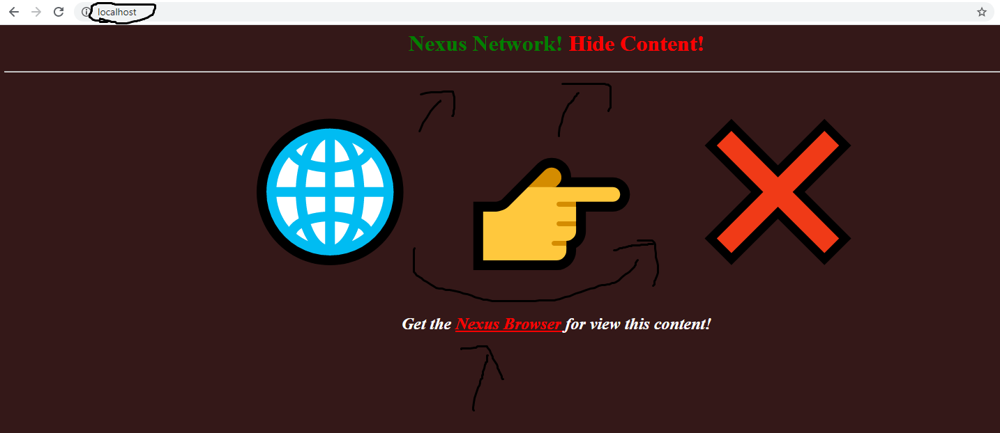
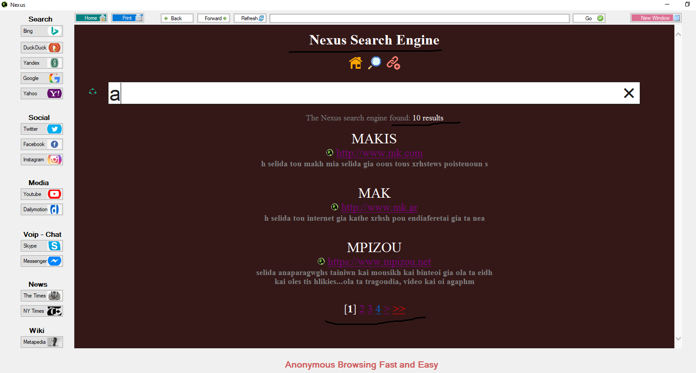
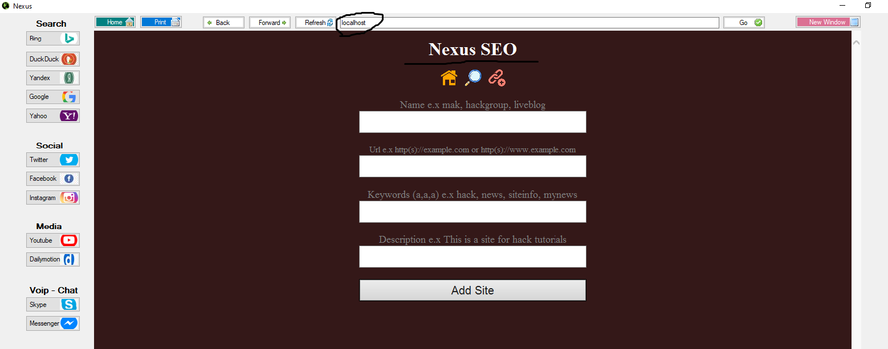
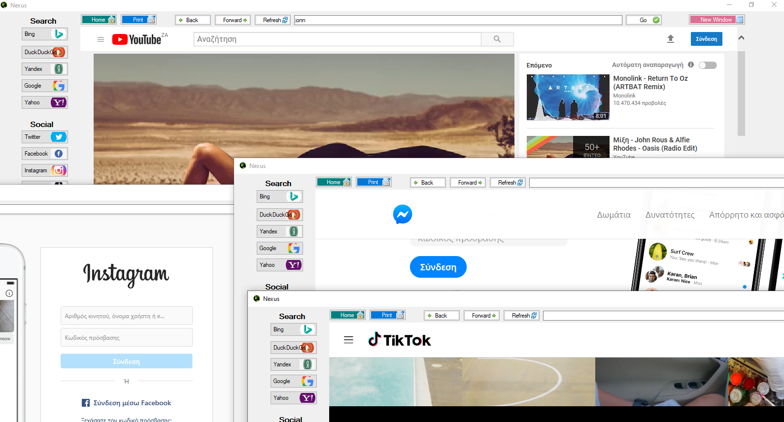

# nexus-browser
Nexus-Browser is a private browser   

i) Download the zip file  
ii) Extract and run from folder the nexus.exe file  

<a href="https://github.com/makdosx/nexus-browser/raw/master/download/nexus-browser.zip"> Download </a>   

Properties and Details   
1) Supports all windows operating systems after windows xp   windows xp, vista, 7, 8, 8.1, 10   
2) Private browsing
3) Hide content of websites from other browsers
4) Search engine
5) SEO Tools
6) SOON AVAILABLE: Free webhosting and domain names. Domains extension end is .nex e.x domain.nex 
7) Anonymous activity (no save cookies, ip, location etc)   
8) Supports many windows for fast and safe browsing  
9) Many default famous web apps with one button  
10) No installation to your pc. Run browser directly  
11) Print your data and connect to your printer  
12) Fast easy and simple graphical interface for use  
 

    

     

    

    

    

